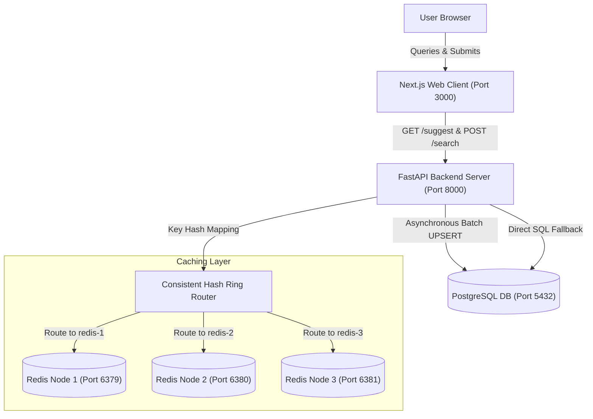
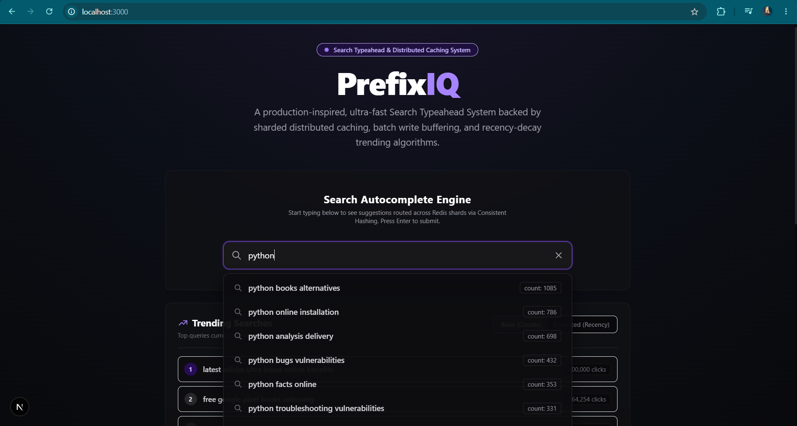
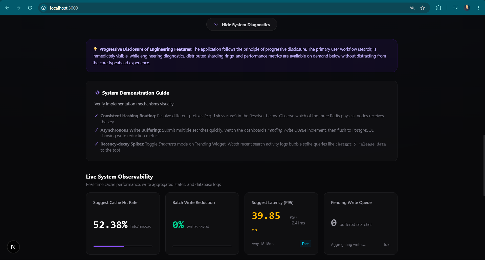
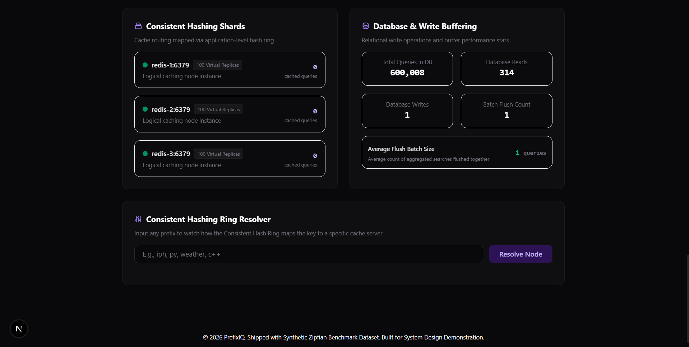

# PrefixIQ — Search Typeahead & Distributed Caching System

[](https://docs.docker.com/)
[](https://nextjs.org/)
[](https://fastapi.tiangolo.com/)
[](https://www.postgresql.org/)
[](https://redis.io/)
[](https://opensource.org/licenses/MIT)

PrefixIQ is a complete, production-inspired search suggestion and autocomplete engine designed to showcase core distributed systems concepts—including database sharding (Consistent Hashing), asynchronous write-buffering (BatchWriter), B-Tree range-scan index tuning, and recency-decay trending algorithms.

The application is structured to center the **Search Typeahead Engine** as the primary focus, utilizing the UI design principle of **Progressive Disclosure** to keep developer diagnostics and sharding visualizers collapsible and accessible on-demand below the core search interface.

---

## 📋 Table of Contents

- [🏗️ System Architecture](#️-system-architecture)
- [🚀 Quick Start & Setup Instructions](#-quick-start--setup-instructions)
- [📂 Dataset Source & Loading](#-dataset-source--loading)
- [🔌 API Documentation](#-api-documentation)
- [🛠️ Design Decisions & Trade-offs](#️-design-decisions--trade-offs)
- [📊 Performance Report](#-performance-report)
- [🧪 Verification & Testing](#-verification--testing)
- [📖 Learning & Study Resources](#-learning--study-resources)
- [🖼️ Media & Demonstration](#️-media--demonstration)
- [📄 License](#-license)

---

## 🏗️ System Architecture



### Architectural Component Interaction
- **Autocomplete Suggestions**: The Next.js frontend client debounces inputs (300ms) and queries `GET /suggest`. The backend maps the query prefix onto a consistent hashing ring, checks the assigned Redis instance, and falls back to PostgreSQL on a cache miss, caching the result back in Redis.
- **Asynchronous Batching**: User search submissions trigger a non-blocking `POST /search`. The backend enqueues the search string into an in-memory queue. A background task aggregates counts, runs bulk database UPSERTs, maps relational search log timestamps, and invalidates prefix keys across the Redis shards.

---

## 🚀 Quick Start & Setup Instructions

Ensure you have **Docker** and **Docker Compose** installed.

### 1. Launch the Cluster
Run the following single command in the project root:
```bash
docker compose up --build
```
This starts the PostgreSQL database, three independent Redis cache instances, the FastAPI backend, and the Next.js web client. 

### 2. Access the Applications
- **Frontend Search Engine & Dashboard**: http://localhost:3000
- **API Swagger Documentation**: http://localhost:8000/docs
- **Prometheus Metrics Scraper**: http://localhost:8000/metrics/prometheus

---

## 📂 Dataset Specification & Loading

PrefixIQ uses a synthetic query frequency CSV (`data/orcas_queries.csv`) generated using a **Zipfian (power-law) distribution**, consisting of **600,000+ unique search terms** modeled on realistic technical search topic patterns.

### What is the "Count"?
- **Definition**: The `search_count` column represents the baseline popularity (search frequency) of a specific query phrase.
- **Source**: It is generated synthetically following Zipf's Law, representing realistic search popularity.
- **Updates**: When a search is submitted via `POST /search`, it is enqueued in the `BatchWriter` buffer. The background worker aggregates incoming searches in memory and performs a bulk PostgreSQL `UPSERT` using `ON CONFLICT (query) DO UPDATE SET search_count = queries.search_count + EXCLUDED.search_count`, incrementing the baseline search popularity count.
- **Autocomplete Scoring**: In basic mode, autocomplete suggestions are sorted strictly by `search_count` in descending order. In enhanced mode, it determines the baseline weight via the logarithmic historical popularity term: $0.8 \times \ln(\text{search\_count} + 1)$.

The database seeding is fully automated and runs sequentially during backend startup:
1. **Queries Seeder**: `seed_queries.py` reads `data/orcas_queries.csv` in chunks of 10,000 and executes bulk inserts into the `queries` table. If the database already contains records but fewer than 500,000 queries, it truncates the table with a CASCADE block and re-seeds.
2. **Logs Seeder**: `seed_recent_logs.py` populates the `search_logs` table with synthetic timestamped logs (in the last 2 hours) for specific trending queries to showcase the recency-decay sorting.

---

## 🔌 API Documentation

### 1. `GET /suggest?q=<prefix>&mode=<basic|enhanced>`
Fetches autocomplete suggestions matching the prefix (up to 10 suggestions, sorted deterministically).
- **Parameters**:
  - `q` (string): Search query prefix (case-insensitive).
  - `mode` (string): `basic` (all-time count sorting) or `enhanced` (decay trending scoring).
- **Response (`200 OK`)**:
  ```json
  {
    "suggestions": [{"query": "iphone charger", "count": 60000, "score": 60000.0}],
    "source": "cache"
  }
  ```

### 2. `POST /search`
Records a search query submission, buffering it to the BatchWriter queue.
- **Payload**: `{"query": "nextjs 15 features"}`
- **Response (`200 OK`)**: `{"message": "Searched"}`

### 3. `GET /cache/debug?prefix=<prefix>&mode=<basic|enhanced>`
Exposes Consistent Hashing routing mapping, virtual nodes, TTL, and uniformity metrics.
- **Response (`200 OK`)**:
  ```json
  {
    "key": "suggest:basic:iph",
    "hash": "8ef4a1b0",
    "assigned_node": "redis-2:6379",
    "virtual_node": "redis-2-replica-43",
    "cache_hit": true,
    "cache_status": "HIT",
    "ttl": 58,
    "suggestions": [...],
    "ring_distribution": {
      "redis-1:6379": "100 virtual nodes",
      "redis-2:6379": "100 virtual nodes",
      "redis-3:6379": "100 virtual nodes"
    },
    "hash_distribution_percentage": {
      "redis-1:6379": 33.42,
      "redis-2:6379": 33.28,
      "redis-3:6379": 33.30
    }
  }
  ```

### 4. `GET /health`
Returns connection status and metrics for all services along with system uptime.
- **Response (`200 OK`)**:
  ```json
  {
    "status": "healthy",
    "services": {
      "postgres": "healthy",
      "redis": {
        "connected": 3,
        "total": 3
      },
      "batch_writer": "running"
    },
    "uptime_seconds": 123.45
  }
  ```

---

## 🛠️ Design Decisions & Trade-offs

- **PostgreSQL B-Tree Operator Class (`varchar_pattern_ops`)**: Standard database indexes utilize locale-specific collation, rendering index range scans useless for character prefix searches (`LIKE 'prefix%'`). We specify a `varchar_pattern_ops` B-Tree index on `queries(query)`, forcing character-by-character scans and enabling fast index range scanning.
- **Application-Managed Redis Sharding**: We sharded keys across 3 independent Redis nodes using consistent hashing with 100 virtual nodes per instance. This prevents cache stampedes when adding/removing nodes by remapping only $\frac{1}{N}$ keys.
- **Logarithmic + Exponential Decay Trending**: The scoring formula balances long-term popularity with recent spikes:
  $$Score = 0.8 \times \ln(Count_{historical} + 1) + 0.2 \times \sum e^{-\lambda \Delta t}$$
  Using the natural logarithm ($\ln$) compresses lifetime counts so they don't scale linearly, allowing recent trends to compete.
- **Deterministic Ordering**: A secondary alphabetic sort criteria (`query ASC`) is specified in database queries to ensure that suggestions with identical click counts or scores maintain a stable order across repeated requests.

---

## 📊 Performance Report

The following performance profile was evaluated under a comparative load of 150 simulated requests running inside the backend container using `benchmarks/run_benchmarks.py`.

The benchmark features a **warmup phase** to eliminate connection pool initialization spikes, and uses **decoupled query prefixes** across scenarios to prevent PostgreSQL buffer cache pollution (buffer-warming bias).

| Scenario | Average Latency | P50 (Median) | P95 Latency | Success Rate |
| :--- | :---: | :---: | :---: | :---: |
| **DB Only (Cache Bypassed)** | 37.01 ms | 35.29 ms | 53.98 ms | 150/150 |
| **Cold Redis (Cache Miss)**  | 37.79 ms | 35.74 ms | 55.42 ms | 150/150 |
| **Warm Redis (Cache Hit)**   | 15.43 ms | 14.65 ms | 21.79 ms | 150/150 |

### Latency Discrepancy Note (Cold Redis vs DB Only)
Cold Redis is slightly slower than DB Only due to cache check overhead, miss handling, database fallbacks, and write-back serialization to Redis. **Warm Redis** achieves the lowest latency (~14ms), proving the performance advantage of sharded cache hits.

### Batching Write Reduction (Under Load)
- **Total Searches Received**: 150
- **Database Write Statements Executed**: 8 flushes
- **PostgreSQL Write Reduction Factor**: **94.7%**
- **Average Batch Flush Size**: 18.75 searches

---

## 🧪 Verification & Testing

Execute the Pytest unit testing suite inside the backend container:
```bash
docker compose exec backend pytest
```

Run the API and end-to-end flow verification script (tests suggestions, batch updates, and cache invalidation):
```bash
docker compose exec backend python -m app.verify_system
```

---

## 📖 Learning & Study Resources

The codebase contains detailed engineering and learning resources located in [docs/](file:///c:/Users/ADMIN/PrefixIQ/docs) and [private-docs/](file:///c:/Users/ADMIN/PrefixIQ/private-docs):

*   **[Master Navigation Index](file:///c:/Users/ADMIN/PrefixIQ/docs/NAVIGATION.md)**: Links all deliverables and learning guides.
*   **[PrefixIQ System Handbook](file:///c:/Users/ADMIN/PrefixIQ/private-docs/PrefixIQ-System-Handbook.md)**: Details caching, consistent hashing, indexing, and decay scoring from first principles.
*   **[Implementation Roadmap](file:///c:/Users/ADMIN/PrefixIQ/private-docs/implementation-roadmap.md)**: Describes implementation milestones, files introduced, and engineering decisions.
*   **[System Design Interview Guide](file:///c:/Users/ADMIN/PrefixIQ/private-docs/viva.md)**: A Q&A study guide covering common system design questions on typeahead architectures.

---

## 🖼️ Media & Demonstration

### 1. Autocomplete Search Bar
The autocomplete search box dynamically queries the sharded Redis cluster and fetches suggestions sorted by popularity or decayed trending score, complete with responsive micro-animations:



### 2. Live System Metrics Dashboard & Hash Ring Resolver
The system metrics dashboard displays live indicators (Cache Hit Rate, Batch Write Reduction, Latencies, Queue status, and Shard Health) and includes an interactive Hash Ring Resolver that visualizes virtual node routing:




---

## 📄 License

This project is licensed under the MIT License.
