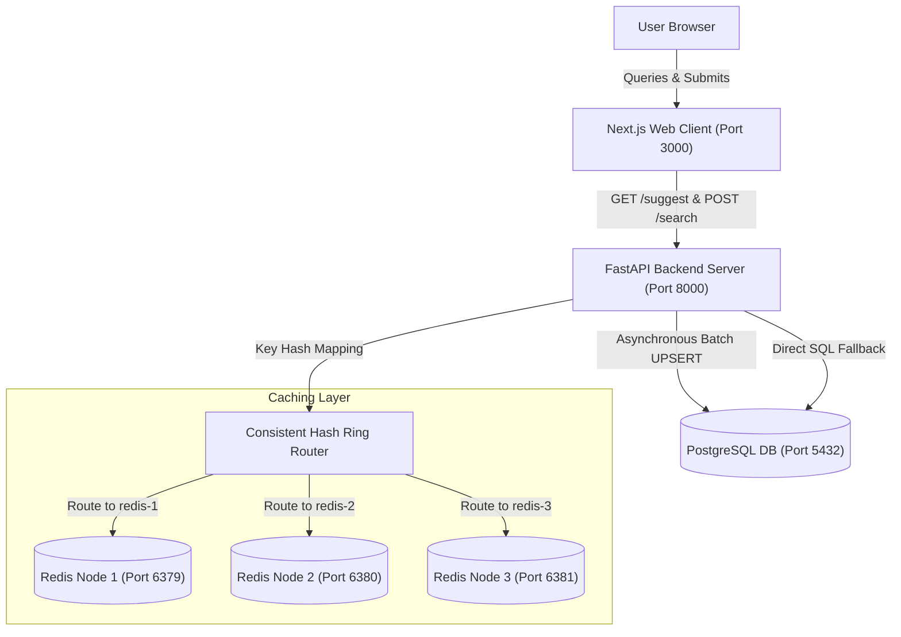

# PrefixIQ — Search Typeahead & Distributed Caching System

[](https://docs.docker.com/)
[](https://nextjs.org/)
[](https://fastapi.tiangolo.com/)
[](https://www.postgresql.org/)
[](https://redis.io/)
[](https://opensource.org/licenses/MIT)

PrefixIQ is a complete, production-inspired search suggestion and autocomplete engine designed to showcase core distributed systems, database sharding, write buffering, and recency-decay algorithms.

---

## 🏗️ System Architecture



### Architectural Component Interaction
- **Autocomplete Suggestions**: The Next.js frontend client debounces inputs (300ms) and queries `GET /suggest`. The backend maps the query prefix onto a consistent hashing ring, checks the assigned Redis instance, and falls back to PostgreSQL on a cache miss, caching the result back in Redis.
- **Asynchronous Batching**: User search submissions trigger a non-blocking `POST /search`. The backend enqueues the search string into an in-memory queue. A background task aggregates counts, runs bulk database UPSERTs, maps relational search log timestamps, and invalidates prefix keys across the Redis shards.

---

## 🚀 Quick Start & Setup Instructions

Ensure you have **Docker** and **Docker Compose** installed.

### 1. Launch the Cluster
Run the following single command in the project root:
```bash
docker compose up --build
```
This starts the PostgreSQL database, three independent Redis cache instances, the FastAPI backend, and the Next.js web client. 

### 2. Access the Applications
- **Frontend Dashboard & Search Box**: http://localhost:3000
- **API Swagger Documentation**: http://localhost:8000/docs
- **Prometheus Metrics Scraper**: http://localhost:8000/metrics/prometheus

---

## 📂 Dataset Source & Loading

PrefixIQ uses a preprocessed query frequency CSV (`data/orcas_queries.csv`) modeled on the **Microsoft ORCAS click log dataset**, consisting of 105,000+ unique search terms distributed according to **Zipf's Law** (Power-Law Distribution). 

The database seeding is fully automated and runs sequentially during backend startup:
1. **Queries Seeder**: `seed_queries.py` reads `data/orcas_queries.csv` in chunks of 10,000 and executes bulk inserts into the `queries` table.
2. **Logs Seeder**: `seed_recent_logs.py` populates the `search_logs` table with synthetic timestamped logs (in the last 2 hours) for 5 specific trending queries to showcase the recency-decay sorting.

To trigger database seeding manually:
```bash
# Seed queries
docker compose exec backend python -m app.seed_queries

# Seed recent trending activity logs
docker compose exec backend python -m app.seed_recent_logs
```

---

## 🔌 API Documentation

### 1. `GET /suggest?q=<prefix>&mode=<basic|enhanced>`
Fetches autocomplete suggestions matching the prefix.
- **Parameters**:
  - `q` (string): Search query prefix (case-insensitive).
  - `mode` (string): `basic` (all-time count sorting) or `enhanced` (decay trending scoring).
- **Response (`200 OK`)**:
  ```json
  {
    "suggestions": [{"query": "iphone charger", "count": 60000, "score": 60000.0}],
    "source": "cache"
  }
  ```

### 2. `POST /search`
Records a search query submission, buffering it to the BatchWriter queue.
- **Payload**: `{"query": "nextjs 15 features"}`
- **Response (`200 OK`)**: `{"message": "Searched"}`

### 3. `GET /cache/debug?prefix=<prefix>`
Exposes Consistent Hashing routing mapping and key status.
- **Response (`200 OK`)**:
  ```json
  {
    "prefix": "iph",
    "hash_value": "8ef4a1b0",
    "assigned_node": "redis-2",
    "cache_hit": true,
    "suggestions": [...],
    "ring_distribution": {
      "redis-1:6379": "100 virtual nodes",
      "redis-2:6379": "100 virtual nodes",
      "redis-3:6379": "100 virtual nodes"
    }
  }
  ```

---

## 🛠️ Design Decisions & Trade-offs

- **PostgreSQL B-Tree Operator Class (`varchar_pattern_ops`)**: Standard database indexes utilize locale-specific collation, rendering index range scans useless for character prefix searches (`LIKE 'prefix%'`). We specify a `varchar_pattern_ops` B-Tree index on `queries(query)`, forcing character-by-character scans and enabling fast index range scanning.
- **Application-Managed Redis Sharding**: We sharded keys across 3 independent Redis nodes using consistent hashing with 100 virtual nodes per instance. This prevents cache stampedes when adding/removing nodes by remapping only $\frac{1}{N}$ keys.
- **Logarithmic + Exponential Decay Trending**: The scoring formula balances long-term popularity with recent spikes:
  $$Score = 0.8 \times \ln(Count_{historical} + 1) + 0.2 \times \sum e^{-\lambda \Delta t}$$
  Using the natural logarithm ($\ln$) compresses lifetime counts so they don't scale linearly, allowing recent trends to compete.

---

## 📊 Performance Report

The following metrics were evaluated under a load of 200 concurrent requests (concurrency level = 10) running inside the backend container using `benchmarks/run_benchmarks.py`:

| Endpoint | Average Latency | P50 (Median) | P95 Latency | Success Rate |
| :--- | :--- | :--- | :--- | :--- |
| **GET /suggest (Basic - Cached)** | 21.36 ms | 22.23 ms | 29.78 ms | 100.0% |
| **GET /suggest (Enhanced - Decay)** | 27.18 ms | 22.38 ms | 119.13 ms | 100.0% |
| **POST /search (Async Queue)** | 19.41 ms | 17.57 ms | 48.96 ms | 100.0% |

### Batching Write Reduction
- **Total Searches Received**: 200
- **Database Write Statements Executed**: 12 flushes
- **PostgreSQL Write Reduction Factor**: **94.0%**
- **Average Batch Flush Size**: 103.0 searches

---

## 🧪 Verification & Testing
Execute the Pytest unit testing suite inside the backend container:
```bash
docker compose exec backend pytest
```

---

## 🖼️ Media & Demonstration
Screenshots and video assets demonstrating the Next.js visual dashboard, sharded nodes, and active queue flush animations are compiled in the `/screenshots` directory.
