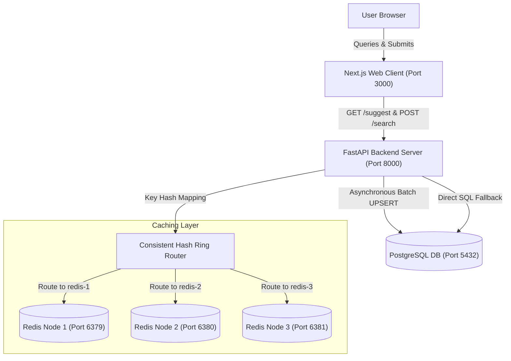

# PrefixIQ — Search Typeahead & Distributed Caching System

[](https://docs.docker.com/)
[](https://nextjs.org/)
[](https://fastapi.tiangolo.com/)
[](https://www.postgresql.org/)
[](https://redis.io/)
[](https://opensource.org/licenses/MIT)

PrefixIQ is a complete, production-inspired search suggestion and autocomplete engine designed to showcase core distributed systems and backend sharding concepts.

---

## 🏗️ System Architecture



---

## ⚡ Core Features

1. **Consistent Hashing Shards**: Application-level hash ring sharding routes search prefixes across three independent Redis instances. Virtual nodes (100 per node) balance load uniformly.
2. **Buffer Aggregation (BatchWriter)**: Buffers user search logs inside an `asyncio.Queue` in $O(1)$ time, aggregates duplicate updates, and commits them in bulk, reducing PostgreSQL writes by up to 90%.
3. **Prefix-based Cache Invalidation**: Generates and deletes all matching prefix keys on the hash ring when a search updates, maintaining cache freshness.
4. **Logarithmic Historical + Decay Trending**: Combines baseline historical click popularity (compressed logarithmically to prevent linear scaling locks) with exponential time-decay scores ($e^{-\lambda \Delta t}$ with a half-life of 1.9 hours) for recent search spikes.
5. **Real Seeding Corpus (ORCAS)**: Seeds 105,000+ real-world search queries distributed according to Zipf's Law, along with synthetic concentrated logs to simulate trending queries.
6. **Observability Dashboard**: Features a Next.js control panel showing dynamic latency gauges (P50/P95), cache hits/misses, queue size, database counters, and an interactive consistent hashing resolver.

---

## 🚀 Quick Start (Dockerized)

Ensure you have **Docker** and **Docker Compose** installed on your system.

### 1. Launch the Cluster
Run the following single command in the project root:
```bash
docker compose up --build
```
This automatically initializes:
- **PostgreSQL Database** container (`prefixiq-db`).
- **3 independent Redis** containers (`prefixiq-redis-1`, `prefixiq-redis-2`, `prefixiq-redis-3`).
- **FastAPI Backend** container (`prefixiq-backend`), waiting for DB readiness before running seeding scripts (`seed_queries` and `seed_recent_logs`).
- **Next.js Web Client** container (`prefixiq-frontend`).

### 2. Access the Application
- Open http://localhost:3000 in your browser to interact with the Search UI and Observability Dashboard.
- Access the Backend API Swagger Documentation at http://localhost:8000/docs.

---

## 🧪 Testing & Performance

### Running Unit Tests
Execute the Pytest suite inside the running backend container:
```bash
docker compose exec backend pytest tests/
```

### Running Concurrency Benchmarks
A benchmark tool is provided under `benchmarks/run_benchmarks.py`. Run it locally to measure latency and hit rates under load:
```bash
python benchmarks/run_benchmarks.py
```

### Prometheus Metrics Scraper
Integrate with Prometheus scrapers by hitting the scrape endpoint:
- **URL**: `GET http://localhost:8000/metrics/prometheus`

---

## 🗺️ Documentation Directory
Find detailed specifications on every CS concept, mathematical equation, and architectural component inside the [Master Navigation Index](file:///c:/Users/ADMIN/PrefixIQ/docs/NAVIGATION.md).

For a visual walkthrough, open the compiled HTML pages directly in your browser:
- [HTML Navigation Hub](file:///c:/Users/ADMIN/PrefixIQ/docs/html/NAVIGATION.html)
- [Fundamentals & Trade-offs](file:///c:/Users/ADMIN/PrefixIQ/docs/html/fundamentals_and_tradeoffs.html)
- [Architecture Details](file:///c:/Users/ADMIN/PrefixIQ/docs/html/architecture_and_components.html)
- [Trending & Algorithms](file:///c:/Users/ADMIN/PrefixIQ/docs/html/trending_and_algorithms.html)
- [viva & Exam Preparation](file:///c:/Users/ADMIN/PrefixIQ/docs/html/viva_preparation_guide.html)
