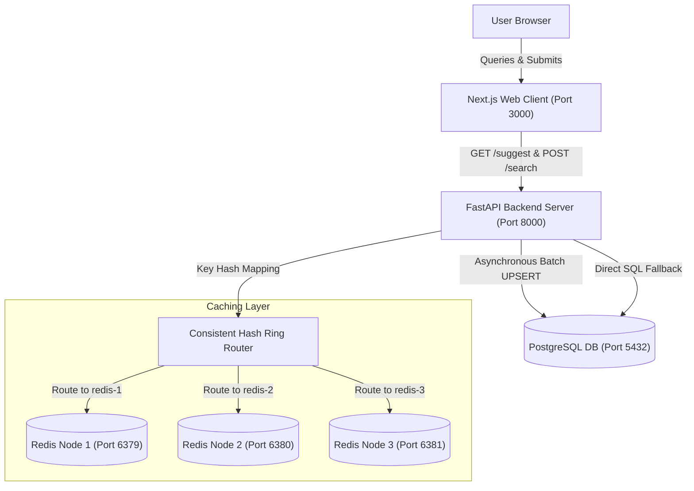
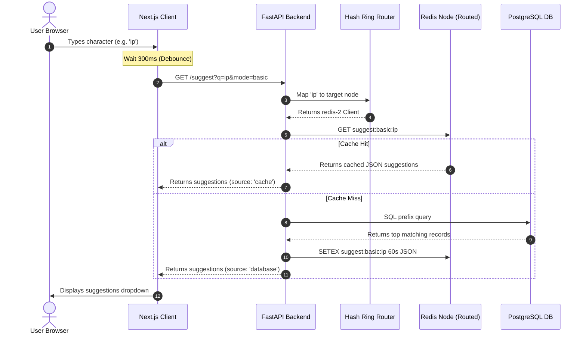
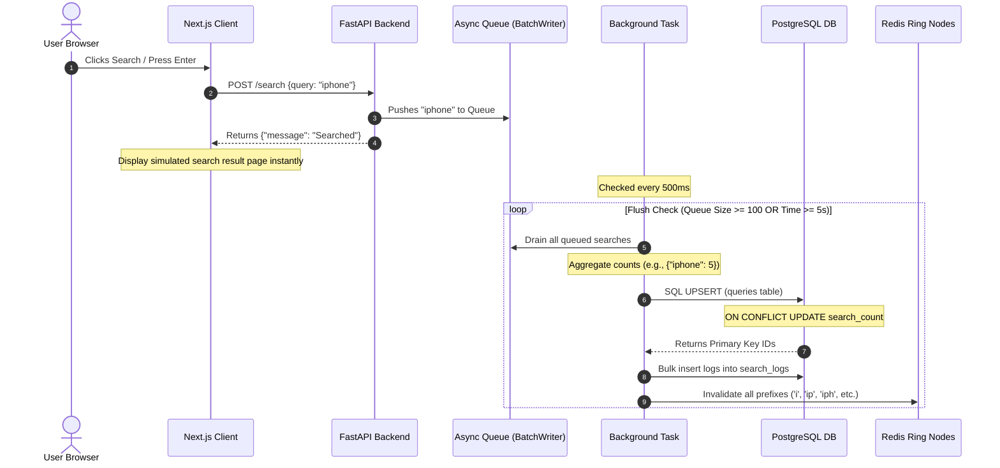

# System Architecture & Core Components

This document describes the structural layout, component boundaries, and request flows of the PrefixIQ Search Typeahead System.

---

## 1. Overall System Architecture

The system consists of a Next.js frontend, a FastAPI backend, a PostgreSQL relational database, and three independent Redis instances representing logical cache shards.



---

## 2. Request Flows

### 2.1 Suggestion Request Flow (`GET /suggest`)


### 2.2 Search Submission & Batch Write Flow


---

## 3. Core Components Detail

### 3.1 Consistent Hash Ring (`consistent_hashing.py`)
- **Key Ring Concept**: Physical Redis servers are positioned on a ring mapped to a 32-bit integer space ($0$ to $2^{32}-1$).
- **Replication**: To ensure uniform distribution, each physical node generates 100 virtual nodes (e.g., `redis-1-replica-0` to `redis-1-replica-99`) on the ring.
- **Routing**: A prefix's SHA-256 hash maps to a point on the ring. The router performs a binary search (`bisect_right`) to find the next available virtual node clockwise, resolving to its physical host.

### 3.2 Relational Database Schema (`models.py`)
Data is stored relationally using two tables:
- **`queries`**: Contains aggregate query counts used for autocomplete suggestion lookups. It features an index optimized for rapid prefix string scans:
  ```sql
  CREATE INDEX idx_queries_query_pattern ON queries(query varchar_pattern_ops);
  ```
- **`search_logs`**: Stores individual timestamped entries of query searches. When a search for a query is flushed, we obtain its mapped `id` from the `queries` table via PostgreSQL `RETURNING id` and bulk-insert an entry in `search_logs`. This supports the recency decay calculations.

### 3.3 Asynchronous Batch Writer (`batch_writer.py`)
The `BatchWriter` buffers search query strings to protect PostgreSQL from concurrent write locks.
- **In-Memory Buffering**: FastAPI endpoints enqueue searches onto an `asyncio.Queue` in $O(1)$ time.
- **Aggregated SQL execution**: The queue is drained and aggregated. Rather than executing $N$ inserts, the worker performs $U$ aggregate updates (where $U$ is the count of unique query strings), executing `INSERT ... ON CONFLICT DO UPDATE`.
- **Active Prefix Cache Invalidation**: To keep cached autocomplete lists accurate, the worker generates all prefixes for each flushed search. For example, for "iphone", it invalidates `"i"`, `"ip"`, `"iph"`, `"ipho"`, `"iphon"`, `"iphone"` across the Redis shards.
