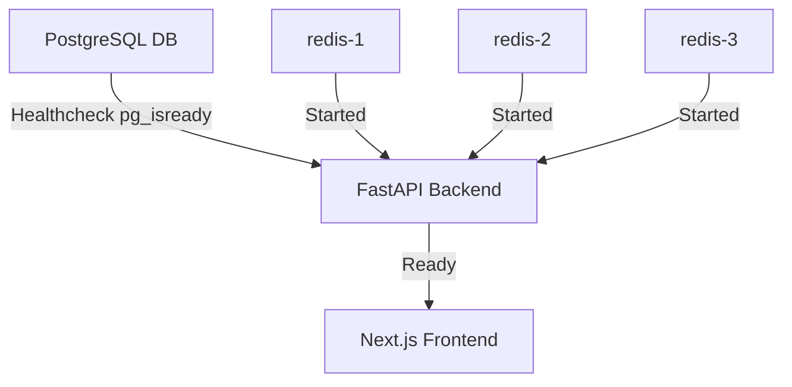

# Infrastructure & Benchmarking Guide

This document describes how to deploy the PrefixIQ system using Docker Compose, run performance benchmarks, and monitor Prometheus metrics.

---

## 1. Docker Compose Infrastructure Orchestration

PrefixIQ runs as a multi-container cluster. The startup order is strictly synchronized to prevent connection race conditions.



### 1.1 Core Setup & Execution
Run the following command in the root folder (where `docker-compose.yml` is located) to start the system:
```bash
docker compose up --build
```
This command automatically:
1. Starts the PostgreSQL container and waits for database health checks.
2. Starts three independent Redis instances.
3. Launches the Backend container, initializes tables, and runs seeder scripts (`seed_queries.py` and `seed_recent_logs.py`).
4. Launches the Next.js Frontend container on port 3000.

---

## 2. Load-testing & Benchmarks

The project includes an automated load-testing benchmark script in `benchmarks/run_benchmarks.py`.

### 2.1 Running the Benchmark
Ensure the Docker containers are running, then execute the benchmarks locally:
```bash
python benchmarks/run_benchmarks.py
```

### 2.2 Metrics Reported
The benchmarking suite evaluates the endpoints under concurrency:
- **GET /suggest (Basic)**: Measures search latency when suggestions are resolved via lifetime counts (often hitting the Redis consistent hash ring).
- **GET /suggest (Enhanced)**: Measures latency when suggestions are computed with recency decay (involving a join over recent log timestamps on a cache miss).
- **POST /search**: Measures the speed of submitting search strings to the asynchronous queue buffer.
- **Batching write reduction stats**: Gathers final DB read/write counters.

---

## 3. Scannable Prometheus Metrics

The backend exposes a Prometheus-compatible endpoint at `/metrics/prometheus` for integration with monitoring tools.

### 3.1 Scraping Output Example
The response is returned in plain text format (`text/plain`), making it immediately scannable by Prometheus scraping agents:

```text
# HELP prefixiq_suggest_requests_total Total autocomplete suggestions requests.
# TYPE prefixiq_suggest_requests_total counter
prefixiq_suggest_requests_total 1250

# HELP prefixiq_cache_hits_total Total suggestions successfully served from Redis cache.
# TYPE prefixiq_cache_hits_total counter
prefixiq_cache_hits_total 1050

# HELP prefixiq_cache_misses_total Total suggestions that missed Redis cache and fell back to DB.
# TYPE prefixiq_cache_misses_total counter
prefixiq_cache_misses_total 200

# HELP prefixiq_suggest_latency_average_ms Average autocomplete API latency in milliseconds.
# TYPE prefixiq_suggest_latency_average_ms gauge
prefixiq_suggest_latency_average_ms 1.84

# HELP prefixiq_searches_submitted_total Total searches submitted by users.
# TYPE prefixiq_searches_submitted_total counter
prefixiq_searches_submitted_total 450

# HELP prefixiq_db_writes_total Total write statements executed on PostgreSQL database.
# TYPE prefixiq_db_writes_total counter
prefixiq_db_writes_total 8

# HELP prefixiq_batch_writer_flushes_total Total times batch writer has flushed queue to database.
# TYPE prefixiq_batch_writer_flushes_total counter
prefixiq_batch_writer_flushes_total 8

# HELP prefixiq_batch_queue_length Current size of the in-memory batch write buffer.
# TYPE prefixiq_batch_queue_length gauge
prefixiq_batch_queue_length 0
```
- **viva Prep Tip**: Mentioning Prometheus-style metrics in a viva demonstrates an understanding of modern cloud-native observability standards, transforming the project from a student assignment into a production-ready model.
