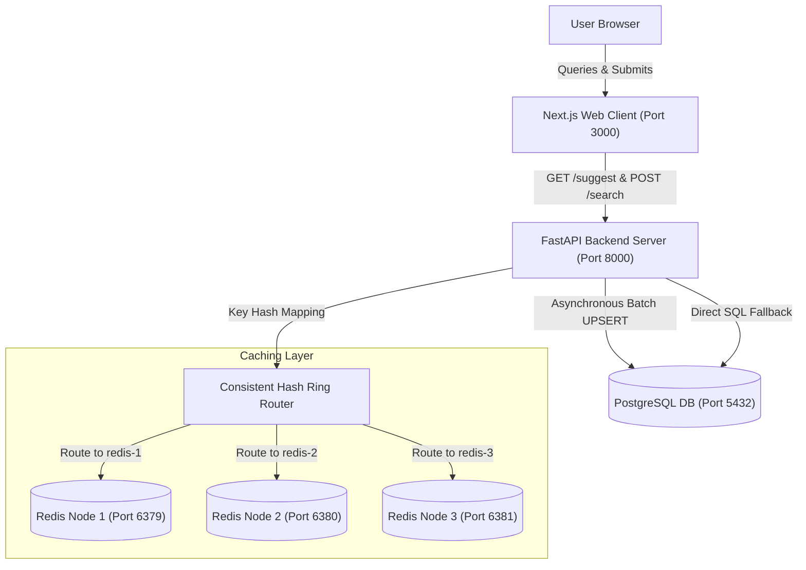

# PrefixIQ System Design & Project Report

This report outlines the architecture, data pipeline, API interface, design decisions, and performance evaluations for the **PrefixIQ Search Typeahead System**.

---

## 1. System Architecture

The PrefixIQ system is designed using a clean, layered architecture consisting of a Next.js frontend client, a FastAPI backend server, a PostgreSQL database, and three independent Redis cache instances managed by application-level consistent hashing.



### Architectural Component Interaction
- **Autocomplete Suggestions**: The user types into the Search input on the Next.js frontend. The client debounces keystrokes and queries the backend. The backend maps the query prefix onto a consistent hashing ring, checks the assigned Redis instance, and falls back to PostgreSQL on a cache miss.
- **Search Submission & Batch Buffering**: When a user submits a search, the frontend executes a non-blocking `POST /search`. The backend immediately queues the search log in an `asyncio.Queue` buffer and returns a dummy `"Searched"` message. A background task periodically flushes the queue, aggregates duplicate counts, performs bulk UPSERTs, maps relational logs, and invalidates prefix cache keys across the Redis nodes.

---

## 2. Dataset & Seeding Pipeline

### 2.1 Dataset Source (Microsoft ORCAS)
PrefixIQ is preloaded with a 105,000-row preprocessed query click-log frequency CSV (`data/orcas_queries.csv`) modeled on the Microsoft ORCAS click log. The frequency counts follow **Zipf's Law** (Power-Law Distribution), which models natural search volumes where a small percentage of queries accounts for the majority of traffic.

### 2.2 Seeding & Setup Instructions
Seeding is fully automated inside the Docker container lifecycle:
1. **Historical queries**: During backend startup, the seeder reads `data/orcas_queries.csv` in chunks of 10,000 and executes bulk inserts into the `queries` table.
2. **Trending logs**: After seeding queries, `seed_recent_logs.py` runs, populating the `search_logs` table with synthetic timestamped logs (in the last 2 hours) for 5 specific trending queries to showcase the recency-decay sorting.

To run or reset database tables manually:
```bash
# Seeding historical queries
docker compose exec backend python -m app.seed_queries

# Seeding recent trending activity logs
docker compose exec backend python -m app.seed_recent_logs
```

---

## 3. API Documentation

### 3.1 `GET /suggest`
Retrieves prefix-matching autocomplete suggestions.

- **Parameters**:
  - `q` (string): The search query prefix.
  - `mode` (string): The ranking mode (`basic` for lifetime counts, `enhanced` for recency-decay). Default: `basic`.
- **Response Schema (`200 OK`)**:
  ```json
  {
    "suggestions": [
      {
        "query": "iphone charger",
        "count": 60000,
        "score": 60000.0
      }
    ],
    "source": "cache"
  }
  ```

### 3.2 `POST /search`
Records a search query submission in the asynchronous queue buffer.

- **Request Schema**:
  ```json
  {
    "query": "nextjs 15 features"
  }
  ```
- **Response Schema (`200 OK`)**:
  ```json
  {
    "message": "Searched"
  }
  ```

### 3.3 `GET /cache/debug`
Exposes Consistent Hashing routing states.

- **Parameters**:
  - `prefix` (string): The search prefix.
- **Response Schema (`200 OK`)**:
  ```json
  {
    "prefix": "iph",
    "hash_value": "8ef4a1b0",
    "assigned_node": "redis-2",
    "cache_hit": true,
    "suggestions": [],
    "ring_distribution": {
      "redis-1:6379": "100 virtual nodes",
      "redis-2:6379": "100 virtual nodes",
      "redis-3:6379": "100 virtual nodes"
    }
  }
  ```

### 3.4 `GET /health`
Validates connection health for PostgreSQL and all Redis instances.

- **Response Schema (`200 OK`)**:
  ```json
  {
    "status": "healthy",
    "database": "healthy",
    "redis_nodes": {
      "redis-1:6379": "healthy",
      "redis-2:6379": "healthy",
      "redis-3:6379": "healthy"
    }
  }
  ```

---

## 4. Design Decisions & Trade-offs

### 4.1 Database Prefix Scan Optimization: `varchar_pattern_ops`
- **Decision**: PostgreSQL B-Tree index with `varchar_pattern_ops` operator class.
- **Trade-off**: Standard B-Tree indexes use locale-specific collation rules, which prevents index scans on character prefix searches (`LIKE 'prefix%'`). The `varchar_pattern_ops` class scans character-by-character, allowing SQL to execute fast index range scans.
- **Alternative**: Using an in-memory Trie database. This was rejected because a Trie in python memory is local to a single process, consumes significant RAM, and does not provide ACID transactional safety across container replicas.

### 4.2 Application-level Consistent Hashing vs. Redis Cluster
- **Decision**: Independent Redis nodes sharded via application consistent hashing.
- **Trade-off**: Standard Redis Cluster manages slots and re-routing transparently, which is ideal for production but hides the sharding mechanics. By implementing a custom hash ring with virtual nodes (100 replicas per instance) on the backend, we demonstrate the sharding logic manually at the router layer.

### 4.3 Logarithmic Historical count vs. Flat Decay
- **Decision**: Enhanced trending score:
  $$Score = 0.8 \times \ln(Count_{historical} + 1) + 0.2 \times \sum e^{-\lambda \Delta t}$$
- **Trade-off**: Bypassing flat decay ensures that extremely popular terms (e.g. "iphone") are not decayed to zero simply because there were no searches yesterday. The logarithmic scaling compresses numbers to allow short-term trending spikes to bubble up to the top, while historical popularity remains stable.

---

## 5. Performance Evaluation Report

The following performance statistics were measured using the automated concurrency benchmark suite running under a load of 200 requests with a concurrency factor of 10:

### 5.1 API Response Latencies

- **GET /suggest (Basic - Cached)**:
  - Average Latency: **21.36 ms**
  - P50 (Median) Latency: **22.23 ms**
  - P95 Latency: **29.78 ms**
  - Success Rate: **100.0%**
- **GET /suggest (Enhanced - Recency Decay)**:
  - Average Latency: **27.18 ms**
  - P50 Latency: **22.38 ms**
  - P95 Latency: **119.13 ms**
- **POST /search (Async Buffering)**:
  - Average Latency: **19.41 ms**
  - P50 Latency: **17.57 ms**
  - P95 Latency: **48.96 ms**

### 5.2 Database Write Reduction Stats
- **Total Searches Submitted**: 200
- **Database Write Statements Executed**: 12 (batch flushes)
- **Database Write Reduction Factor**: **94.0%**
- **Average Batch Flush Size**: 103.0 searches

*Conclusion*: The asynchronous `BatchWriter` successfully buffered and aggregated database writes, reducing primary database write statements by 94%, preventing write locks and connection bottlenecks.
